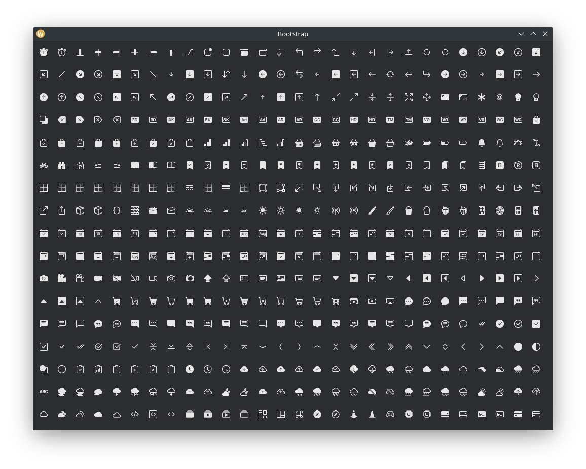
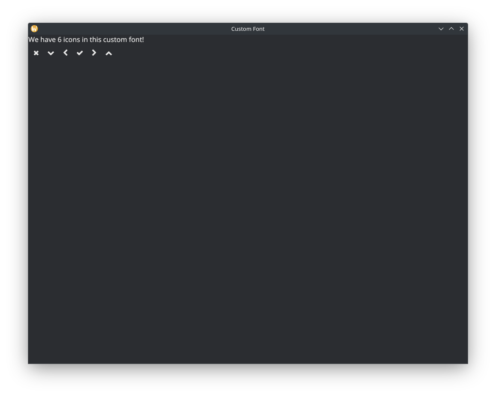

# iced_fonts
Include fonts via feature flags in your Iced project!

[](https://docs.rs/iced_fonts)
[](https://crates.io/crates/iced_fonts)
[](./LICENSE)
[](https://crates.io/crates/iced_fonts)
[](https://discourse.iced.rs/)
[](https://discord.gg/3xZJ65GAhd)

## Usage

```rs
use iced_fonts::{LUCIDE_FONT_BYTES, lucide::*};
    
fn view(&self) -> Element<Message> {
    row![
        git_branch(),
        git_commit_horizontal(),
        git_merge(),
        git_pull_request(),
        github(),
        gitlab(),
    ]
}
```

<p float="left">
  
   
  
</p>

Include `iced_fonts` as a dependency in your `Cargo.toml`:
```toml
[dependencies]
iced_fonts = { version = "0.2.0", features = [...] }
```

## Versioning

| `iced` version | `iced_fonts` version |
| -------------- | ---------------------|
| 0.13.x         | 0.1.x, 0.2.x         |
| 0.14.x         | master branch        |

## Fonts
Fonts can all be enabled with feature flags. All the fonts can be enabled with the `full` feature flag. By default there are no fonts added. 

> **_NOTE:_**  By enabling a feature flag you add the full size of the font file(s) to your binary.

The Following are a link to the source followed by their feature flag name.

* [Bootstrap](https://icons.getbootstrap.com) `bootstrap`
* [Codicon](https://microsoft.github.io/vscode-codicons/dist/codicon.html) `codicon`
* [Devicon](https://devicon.dev/) `devicon`
* [FontAwesome](https://fontawesome.com/icons/packs/classic) `fontawesome`
* [Lucide](https://lucide.dev/icons/) `lucide`
* [Nerd Fonts (Symbols Only)](https://www.nerdfonts.com/) `nerd`
* [Octicons](https://primer.style/octicons/) `octicons`
* [Pomicons](https://github.com/gabrielelana/pomicons) `pomicons`


### Bring your own Font!
One problem people bring up is that they only need a few icons. So the macro used by this library is exported for public use. See the `custom` example.

### Failed fonts.
Saddly some fonts are not supported because they are not given proper names in the `post` table. This is a failure of the font author and there is nothing we can do about these. We cannot generate/lookup names that are not in the font. The currently list of these follows

* Material Icons (avaiable via nerd font)
* Weather Icons (avaiable via nerd font)


# Contributing
If you would like to request a new font, please open an issue with the font's name and where to download the ttf file from.

### Roadmap
Somethings that need to be done are.
1. Use basic shaping where possible, we shouldn't pay a fee we aren't required to.
2. Add more useful fonts if possible, this depends on if they have properly setup tables.
3. Look into svg support. Once a demo is done it's easy to make a proc macro for it.
